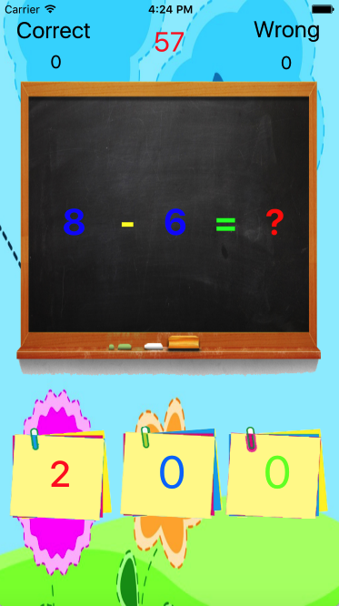

# Học toán cho trẻ  - Math for kid

Các phép toán cộng trừ nhân đơn giản đươc xuất hiện ngẫu nhiên và vị trí chọn kết quả.

## Nền tảng

IOS > 10.1

## Ngôn ngữ, công cụ

* Swift 3.0 
* Xcode 8

### Kĩ thuật

* Giải thuật cơ bản: Random ngẫu nhiên số, phép toán và vị trí button kết quả chính xác
* Sử dụng Timer chạy thời gian
### Lỗi tồn tại

* Giá trị kết quả bị trùng nhau

### Tham khảo
* [Techmaster](https://techmaster.vn/) - Thiết kế giao diện
